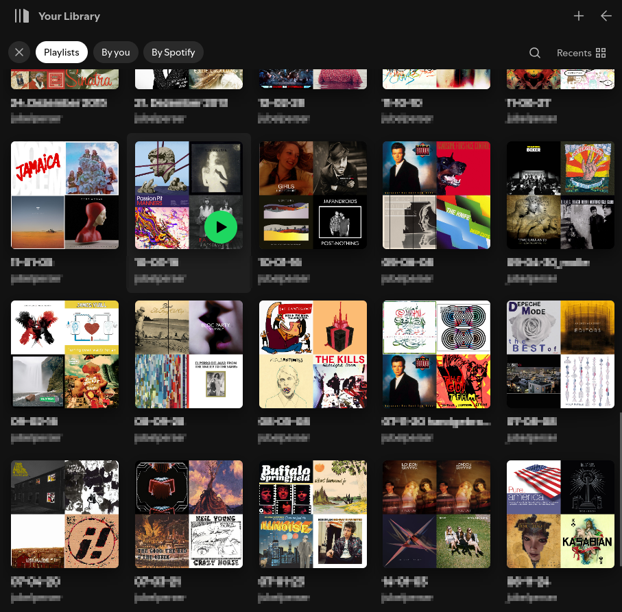
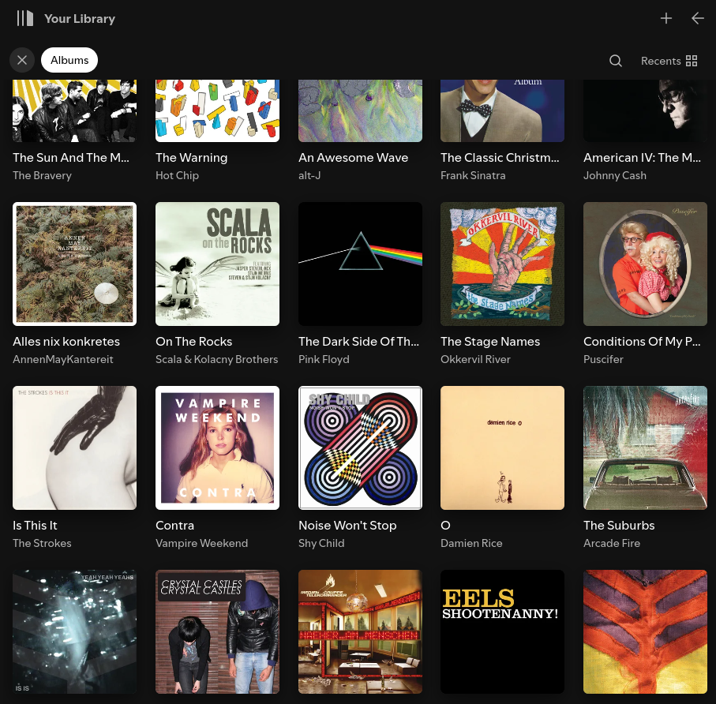

+++
title = "Synchronizing your Local Music Library with Spotify or How to Match Songs Across Catalogues"
date = 2022-02-27
+++

## The Problem

I've been collecting music digitally since my teenage years. Back then, this
often meant buying physical CDs, ripping them to my hard drive, and meticulously compressing them to MP3s using
carefully tweaked LAME settings. Over time, Amazon made things easier by shipping CDs directly and eventually offering
DRM-free MP3 downloads. At the same time, my setup evolved from a local hard drive and MP3-CDs in a Discman to a NAS
hosting my music
library, organized with [beets](https://beets.io), and served to various devices via [jellyfin](https://jellyfin.org/).
Until now: Its ubiquitous music collection, recommendation features and indisputable convenience led me to finally
buying into spotify.
But what do I do with my decades-old, carefully curated collection, complete with hundreds of albums,
various samplers, and custom playlists? Getting all that history accurately represented in Spotify turned out to be more
complicated than I initially thought.

Fortunately, thanks to the fantastic [Tomahawk player](https://github.com/tomahawk-player/tomahawk), all my playlists
were already stored
in [XSPF](https://xspf.org/) format. XSPF is a simple XML format designed to store metadata that *identifies* music
content rather than linking directly to files. This makes playlists portable across different platforms, theoretically
bridging local files and streaming services like Spotify. Unfortunately, XSPF seems to be too niche for Spotify's import
features. This led me to Sam Thursfield's [Calliope](https://calliope-music.readthedocs.io) project, described as
a "[...] toolkit for working with playlists of music." It already included an XSPF reader and Spotify
integration, is written in Python, and is open source – a perfect starting point!

Using Calliope, the basic workflow begins by converting existing XSPF playlists to Calliope's JSON lines format:

```shell
$ calliope import ~/Playlists/example.xspf > example.jspf
```

After this step, example.jspf contains entries like this for each track:

```json
{
  "title": "Bitter Sweet Symphony",
  "creator": "The Verve",
  "duration": 275
}
```

Before this playlist can be uploaded to Spotify, its items need to be "resolved" against the Spotify catalog to add
Spotify-specific metadata:

```shell
$ calliope spotify --user=<username> resolve example.jspf
```

This adds fields like spotify.uri, spotify.artist_id, etc., to your playlist items:

```json
{
  "title": "Bitter Sweet Symphony",
  "creator": "The Verve",
  "duration": 275,
  "spotify.artist": "The Verve",
  "spotify.artist_id": "2cGwlqi3k18jFpUyTrsR84",
  "spotify.location": "https://open.spotify.com/track/1WYEDcS7WGjv0rG7rmMX3o",
  "spotify.uri": "spotify:track:1WYEDcS7WGjv0rG7rmMX3o",
  "spotify.artist.popularity": 70
}
```

But wait – if you follow that spotify.uri, it links to the six-minute album version of "Bitter Sweet Symphony", while
the song in my original playlist is the Radio Edit, which is only 4:35!

## Resolving Arbitrary Tracks More Accurately

Apparently, Calliope's initial reliance on the standard Spotify search API wasn't sufficient. While it works fine for
straightforward cases, it struggles with finding the exact match for live recordings, specific single or compilation
versions, or tracks with complex collaborations. It turns out, accurately matching a track across different music
catalogs is much more complex than it seems on the surface.

My solution was to develop a more sophisticated matching logic and integrate it directly into Calliope. Thankfully,
Calliope is open source (GPLv3), and the maintainer, Sam, was very supportive of adding a standalone resolver module.
The new [resolvers.py](https://gitlab.com/samthursfield/calliope/-/blob/main/calliope/resolvers.py) module is now part
of the 4.0 release and is used by the `calliope musicbrainz annotate`
and `calliope spotify resolve` commands.

### Scores and Weights

The core algorithm I built follows a three-step process:

1) First, we search for potential matches using the target service's search API. This involves cleaning up initial
   metadata (like removing featuring artists from the main artist field) and using all available information from the
   source item.
2) For each result returned by the search – which we call a _candidate_ item – we compute a set of individual priority
   scores. Each of these priority types has a predefined weight associated with it.
3) Finally, we combine these weighted priorities to calculate a single overall priority score for each candidate, and
   then select the candidate with the highest score as the best match.

### Priorities

At the heart of the resolver are its weights and priorities. Weights, which can be any positive number, determine how
much influence each priority factor has. A weight of 100 serves as a baseline, particularly for core similarity checks
like title, album, and creator. Priorities themselves are values between 0 and 1, representing the confidence level for
a specific match criterion. Figuring out the right combination of these weights and priorities was the most challenging
part, involving a lot of experimentation to get it right for my music collection. The setup currently implemented in
Calliope is detailed in the table below:

| Priority                       | Weight     | Description                                                                                                                              |
|:-------------------------------|:-----------|:-----------------------------------------------------------------------------------------------------------------------------------------|
| `recording.isrcs`              | 1          | Penalty (priority 0) if no ISRCs.                                                                                                        |
| `recording.mb_score`           | 10         | Priority from MusicBrainz score (0-1, scaled from /100).                                                                                 |
| `recording.spotify_popularity` | 10         | Priority from Spotify popularity (0-1, scaled from /100).                                                                                |
| `recording.release_count`      | 5          | Priority favors many releases (0-1, max at 10 releases).                                                                                 |
| `release.secondary_types`      | Dynamic    | Penalty (priority 0) for specific secondary release types (weight varies by type).                                                       |
| `release.status`               | 20         | Penalty (priority 0) for unofficial releases.                                                                                            |
| `release.sampler`              | 5          | Penalty (priority 0) for samplers ("Various Artists").                                                                                   |
| `recording.release-date`       | 1 (or 10)  | Priority favors earlier releases by artist (0-1, based on relative order). Weight 10 if no date, 1 if date exists.                       |
| `similarity.title`             | 100        | Priority from normalized title similarity (0-1, uses `difflib.SequenceMatcher`).                                                         |
| `similarity.creator`           | 100        | Priority from normalized creator similarity (0-1, uses `difflib.SequenceMatcher` with "feat." dropped).                                  |
| `similarity.album`             | 100        | Priority from normalized album similarity (0-1, uses `difflib.SequenceMatcher`).                                                         |
| `similarity.duration`          | 50         | Priority from relative duration similarity (0-1).                                                                                        |
| `similarity.isrc`              | 1E6        | High priority (1.0) for shared ISRCs (perfect match).                                                                                    |
| `musicbrainz.recording_id`     | 1E6        | High priority (1.0) for perfect MusicBrainz Recording ID match.                                                                          |
| `musicbrainz.release_group_id` | 1E6 or 1E4 | High priority (1.0) for perfect MusicBrainz Release Group ID match. Weight 1E6 if candidate is not a track, 1E4 if candidate is a track. |
| `musicbrainz.artist_id`        | 1E6 or 1E4 | High priority (1.0) for perfect MusicBrainz Artist ID match. Weight 1E6 if candidate is an artist, 1E4 if candidate is a track or album. |
| `spotify.id`                   | 1E6        | High priority (1.0) for perfect Spotify Track ID match.                                                                                  |
| `spotify.album_id`             | 1E6 or 1E4 | High priority (1.0) for perfect Spotify Album ID match. Weight 1E6 if candidate is not a track, 1E4 if candidate is a track.             |
| `spotify.artist_id`            | 1E6 or 1E4 | High priority (1.0) for perfect Spotify Artist ID match. Weight 1E6 if candidate is an artist, 1E4 if candidate is a track or album.     |

The weights are chosen to create distinct levels of importance. A weight of 1 has minimal impact, mostly influencing the
result when all other factors are tied. Weights around 100, like those for the main similarity checks, are given to
factors that are generally strong indicators. The highest weights, such as 1E6 for exact ID matches, represent
definitive matches that essentially guarantee a candidate is correct, making them strongly preferred over anything
without such an ID. While currently leveraging MusicBrainz and Spotify data, the system is built in a way that should
make it easy to add priorities from other music libraries down the line.

Back to our example, we can compare two matches, a bad one and our Radio Edit:

| Field                   | Candidate 1                                   | Candidate 2 (The Radio Edit)       |
|:------------------------|:----------------------------------------------|:-----------------------------------|
| `spotify.title`         | Bitter Sweet Symphony - 2004 Digital Remaster | Bitter Sweet Symphony - Radio Edit |
| `spotify.album`         | Pub Jukebox                                   | Bitter Sweet Symphony              |
| `spotify.artist`        | The Verve                                     | The Verve                          |
| `spotify.albumartist`   | Various Artists                               | The Verve                          |
| `spotify.duration_ms`   | 359546.0                                      | 275093.0                           |
| `spotify.date`          | 2019-07-12                                    | 1997-01-01                         |
| `spotify.isrc`          | GBAAA0400535                                  | GBAAA9710468                       |
| `spotify.popularity`    | 4                                             | 53                                 |
| `_.secondary-type-list` | compilation                                   | single                             |
| `_.medium-track-count`  | 34                                            | 4                                  |

Their corresponding priorities are:

| Priority Factor                | Weight | Candidate 1 | Candidate 2 |
|:-------------------------------|:-------|:------------|:------------|
| `recording.spotify_popularity` | 10     | 0.04        | 0.53        |
| `release.secondary_types`      | 5      | 0           |             |
| `release.sampler`              | 5      | 0           |             |
| `recording.release-date`       | 1      | 0.813       | 1.0         |
| `similarity.title`             | 100    | 0.636       | 0.764       |
| `similarity.creator`           | 100    | 1.0         | 1.0         |
| `similarity.duration`          | 50     | 0.765       | 0.9997      |
| **Overall Priority**           |        | **0.749**   | **0.891**   |

The final overall score for each candidate is computed by combining all the individual, weighted priority scores.
Here, the Radio Edit received a higher overall priority score because it performed better on several key factors. For example,
its duration was much closer to the likely reference duration (`similarity.duration`), it had higher Spotify
popularity (`recording.spotify_popularity`), and it avoided penalties applied to Candidate 1 for being a compilation and
having a "Various Artists" album artist (`release.secondary_types`, `release.sampler`). Its title similarity was also
slightly higher, and its release date priority was better. 


## Putting it all Together

While the resolver can automatically select a match above a certain confidence threshold (0.90 in non-interactive mode, 0.95
in interactive mode), finding the exact correct release can still be difficult, sometimes resulting in lower overall
scores where no candidate meets the threshold.

In such cases, for non-interactive runs, Calliope will skip the item and issue a warning. When running
interactively, it presents a sorted list of the top candidates, showing their score and formatted details, and prompts
the user to manually select the best match:

```shell
$ calliope   spotify resolve --interactive example.jspf --output=example-spotify.jspf
Best 100 candidates for The Verve - Bitter Sweet Symphony:
 1 (93.25%): The Verve - Bitter Sweet Symphony (The Verve, 1997-01-01, 4 tracks) - Bitter Sweet Symphony
 2 (92.45%): The Verve - This Is Music: The Singles 92-98 (The Verve, 2004-01-01, 14 tracks) - Bitter Sweet Symphony
 3 (89.98%): The Verve - Cruel Intentions (Various Artists, 1999-01-01, 14 tracks) - Bitter Sweet Symphony
 4 (89.32%): The Verve - 90s Rock (Various Artists, 2017-12-01, 21 tracks) - Bitter Sweet Symphony
 5 (89.30%): The Verve - 90s Mixtape (Various Artists, 2017-07-07, 25 tracks) - Bitter Sweet Symphony
 6 (89.14%): The Verve - Bitter Sweet Symphony (The Verve, 1997-01-01, 4 tracks) - Bitter Sweet Symphony - Radio Edit
 7 (88.92%): The Verve - Virgin Records: 40 Years Of Disruptions (Various Artists, 2013-01-01, 46 tracks) - Bitter Sweet Symphony
 8 (88.90%): The Verve - Britpop Best Of (Various Artists, 2020-06-19, 29 tracks) - Bitter Sweet Symphony
 9 (88.67%): The Verve - Festival Rock Hits (Various Artists, 2021-08-13, 29 tracks) - Bitter Sweet Symphony
10 (88.60%): The Verve - 90's One Hit Wonders (Various Artists, 2022-03-04, 34 tracks) - Bitter Sweet Symphony
11 (88.53%): The Verve - 90er Hits (Various Artists, 2023-10-27, 21 tracks) - Bitter Sweet Symphony
12 (88.52%): The Verve - Classic Hits (Various Artists, 2020-10-23, 36 tracks) - Bitter Sweet Symphony
13 (88.39%): The Verve - Stuck At Home (Various Artists, 2020-03-27, 28 tracks) - Bitter Sweet Symphony
14 (88.27%): The Verve - 90s HITS (Various Artists, 2023-10-26, 21 tracks) - Bitter Sweet Symphony
15 (88.27%): The Verve - WHEN POP WAS COOL (Various Artists, 2019-07-05, 20 tracks) - Bitter Sweet Symphony
16 (88.26%): The Verve - Campfire Music (Various Artists, 2020-07-24, 30 tracks) - Bitter Sweet Symphony
17 (88.24%): The Verve - BRIT POP (Various Artists, 2024-07-10, 47 tracks) - Bitter Sweet Symphony
18 (88.18%): The Verve - hopecore songs (Various Artists, 2024-09-12, 78 tracks) - Bitter Sweet Symphony
19 (88.16%): The Verve - Tubes pour danser - Années 90 (Various Artists, 2022-04-29, 34 tracks) - Bitter Sweet Symphony
20 (88.09%): The Verve - Con sueño (Various Artists, 2024-04-28, 36 tracks) - Bitter Sweet Symphony
Select a match (Press Enter to skip, n for next 20 results): 
```

The resulting playlist item after manual selection (we selected candidate number six) shows the data for the Radio Edit:

```json 
{
  "title": "Bitter Sweet Symphony",
  "creator": "The Verve",
  "duration": 275,
  "spotify.title": "Bitter Sweet Symphony - Radio Edit",
  "spotify.album": "Bitter Sweet Symphony",
  "spotify.artist": "The Verve",
  "spotify.duration_ms": 275093.0,
  "spotify.albumartist": "The Verve",
  "spotify.album_id": "08wjDIHFe2QTZL3ryyY4M9",
  "spotify.id": "1ZAhmC1We4HpL2VWK01qpC",
  "spotify.artist_id": "2cGwlqi3k18jFpUyTrsR84",
  "spotify.date": "1997-01-01",
  "spotify.isrc": "GBAAA9710468",
  "spotify.popularity": 53,
  "calliope.spotify.resolver_score": 0.8913667930618437
}
```

The Spotify catalog doesn't have all releases (especially unofficial ones) and can occasionally miss
certain artists or songs entirely. For my collection, I've found the best results by first resolving items against the
MusicBrainz database and then using that richer metadata to search the Spotify catalog. MusicBrainz offers a much more
powerful search and AFAIK is the most comprehensive and freely available music database out there.

Let's try our initial example, "Bitter Sweet Symphony," again, but resolve it against MusicBrainz first:

```shell
$ python -m calliope   musicbrainz annotate --interactive example.jspf --output=example-musicbrainz.jspf
```

The resulting JSON now includes MusicBrainz metadata:

```json
{
  "title": "Bitter Sweet Symphony",
  "creator": "The Verve",
  "duration": 275,
  "musicbrainz.title": "Bitter Sweet Symphony",
  "musicbrainz.album": "Bitter Sweet Symphony",
  "musicbrainz.artist": "The Verve",
  "musicbrainz.length": 275133.0,
  "musicbrainz.albumartist": "The Verve",
  "musicbrainz.release_group_id": "8912c382-99cd-3175-a259-2382d7b9e261",
  "musicbrainz.recording_id": "7394db63-3f45-4eaf-9f1f-ef7ba1c858b1",
  "musicbrainz.artist_id": "d4d17620-fd97-4574-92a8-a2cb7e72ce42",
  "musicbrainz.date": "1997-06-01",
  "musicbrainz.isrcs": [
    "GBAAA9710468"
  ],
  "calliope.musicbrainz.resolver_score": 0.997653495757035
}
```

This correctly points to the MusicBrainz recording entry
at [https://musicbrainz.org/recording/7394db63-3f45-4eaf-9f1f-ef7ba1c858b1](https://musicbrainz.org/recording/7394db63-3f45-4eaf-9f1f-ef7ba1c858b1).
Notice how the resolver found the exact
correct item with a very high score and didn't even need me to intervene? Even better, MusicBrainz provided the ISRC ("
GBAAA9710468"), which is a unique international identifier for sound recordings. We can now use this ISRC to search
Spotify directly:

```shell
$ calliope spotify resolve --interactive example-musicbrainz.jspf --output=example-spotify.jspf
```

And the output now gives us:

```json
{
  "title": "Bitter Sweet Symphony",
  "creator": "The Verve",
  "duration": 275,
  "musicbrainz.title": "Bitter Sweet Symphony",
  "musicbrainz.album": "Bitter Sweet Symphony",
  "musicbrainz.artist": "The Verve",
  "musicbrainz.length": 275133.0,
  "musicbrainz.albumartist": "The Verve",
  "musicbrainz.release_group_id": "8912c382-99cd-3175-a259-2382d7b9e261",
  "musicbrainz.recording_id": "7394db63-3f45-4eaf-9f1f-ef7ba1c858b1",
  "musicbrainz.artist_id": "d4d17620-fd97-4574-92a8-a2cb7e72ce42",
  "musicbrainz.date": "1997-06-01",
  "musicbrainz.isrcs": [
    "GBAAA9710468"
  ],
  "calliope.musicbrainz.resolver_score": 0.997653495757035,
  "spotify.title": "Bitter Sweet Symphony - Radio Edit",
  "spotify.album": "Bitter Sweet Symphony",
  "spotify.artist": "The Verve",
  "spotify.duration_ms": 275093.0,
  "spotify.albumartist": "The Verve",
  "spotify.album_id": "08wjDIHFe2QTZL3ryyY4M9",
  "spotify.id": "1ZAhmC1We4HpL2VWK01qpC",
  "spotify.artist_id": "2cGwlqi3k18jFpUyTrsR84",
  "spotify.date": "1997-01-01",
  "spotify.isrc": "GBAAA9710468",
  "spotify.popularity": 53,
  "calliope.spotify.resolver_score": 0.9999716541312609
}
```

Success! We now have the exact Spotify link for the "Bitter Sweet Symphony - Radio Edit," the one that matches my
original playlist item's duration, and we achieved this without any manual selection, thanks to the MusicBrainz step.

Finally, importing the resolved playlist into Spotify is as easy as:

```shell
$ calliope spotify import example-spotify.jspf
```

### Syncing Albums

Beyond just playlists, I also wanted a way to synchronize my album collection with Spotify. Conveniently, Calliope's
playlist items aren't limited to just tracks; they can also represent artists or albums. Calliope also has an adapter
for Beets, which is perfect for obtaining structured data about my local library.

We can use th Beets adapter to generate a list of all my albums:

```shell
$ calliope beets albums > albums.jspf
```

This produces JSON entries for each album, like:

```json
{
  "album": "Urban Hymns",
  "creator": "The Verve",
  "location": "file:///mnt/datenhaufen/music/Albums/The%20Verve/1997-09-29%20-%20Urban%20Hymns"
}
```

Similar to the track example, this list can first be resolved against MusicBrainz:

```shell
$ calliope   musicbrainz annotate --interactive albums.jspf --output=collection_albums-mb.jspf
```

...yielding MusicBrainz metadata for each album:

```json
{
  "album": "Urban Hymns",
  "creator": "The Verve",
  "location": "file:///mnt/datenhaufen/music/Albums/The%20Verve/1997-09-29%20-%20Urban%20Hymns",
  "musicbrainz.album": "Urban Hymns",
  "musicbrainz.albumartist": "The Verve",
  "musicbrainz.release_group_id": "3dd0c8e4-af53-3605-9c20-f27c7635fb60",
  "musicbrainz.release_id": "51c91d25-78ab-4dd5-aa6d-b168ba4f2034",
  "musicbrainz.artist_id": "d4d17620-fd97-4574-92a8-a2cb7e72ce42",
  "musicbrainz.date": "1997-09-29",
  "calliope.musicbrainz.resolver_score": 0.997788833609729
}
 ```

And finally, resolved against Spotify:

```json
{
  "album": "Urban Hymns",
  "creator": "The Verve",
  "location": "file:///mnt/datenhaufen/music/Albums/The%20Verve/1997-09-29%20-%20Urban%20Hymns",
  "musicbrainz.album": "Urban Hymns",
  "musicbrainz.albumartist": "The Verve",
  "musicbrainz.release_group_id": "3dd0c8e4-af53-3605-9c20-f27c7635fb60",
  "musicbrainz.release_id": "51c91d25-78ab-4dd5-aa6d-b168ba4f2034",
  "musicbrainz.artist_id": "d4d17620-fd97-4574-92a8-a2cb7e72ce42",
  "musicbrainz.date": "1997-09-29",
  "calliope.musicbrainz.resolver_score": 0.997788833609729,
  "spotify.album": "Urban Hymns (Super Deluxe / Remastered 2016)",
  "spotify.albumartist": "The Verve",
  "spotify.album_id": "6xrNJQoPPnhWkzI3fN4jW6",
  "spotify.artist_id": "2cGwlqi3k18jFpUyTrsR84",
  "spotify.date": "1997-09-29",
  "calliope.spotify.resolver_score": 0.6987788331071912
}
```

It successfully linked the local album to its Spotify equivalent.

After adding a small patch (also included in a 4.0 release), Calliope can now import albums and
artists directly into the "My Library" section on Spotify:

```shell
calliope spotify import albums-sp.jspf --library
```

I now have all my playlists in my library:

And my Albums (or at least those available on Spotify):



