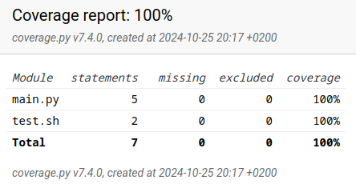
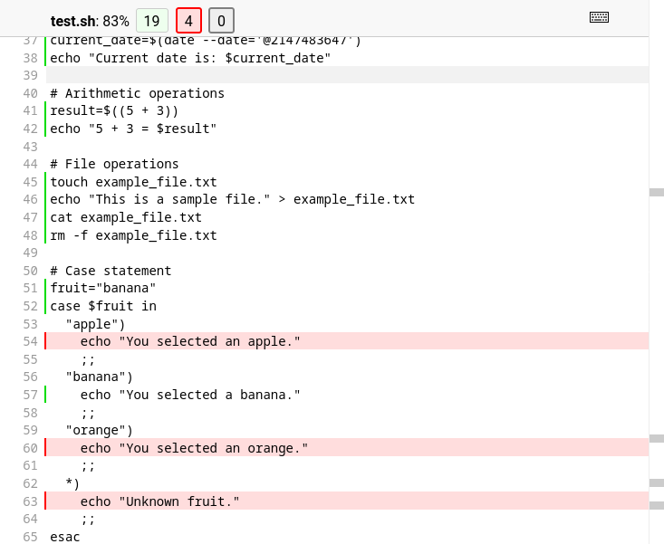

+++
title = "Measuring Code Coverage of Shell Scripts from Python"
date = 2024-10-25
+++

Sometimes, you inherit a large, complex, and often unmaintainable codebase written entirely in shell scripts (like `sh`,
`bash`, `ksh`, etc.). In this situation, porting it to a more accessible, safer, more popular,
feature-rich and in every way superior language such as Python can be a good idea.
But how do we ensure we don't introduce regressions or bugs during this process? Even setting aside any personal "obsession"
with testing, the answer is, of course, tests! However, when porting the tests to the new language
simultaneously, we risk breaking them just as much as breaking the actual code we are migrating.

This risk can be mitigated by writing our tests in Python right from the start. And to ensure these new tests cover as
much of the existing shell code's behavior as possible, we need to measure their coverage of that original shell
codebase. Since we are already migrating to Python, this would ideally use existing Python tooling like [pytest](https://docs.pytest.org)
and [Coverage.py](https://coverage.readthedocs.io).

Enter [coverage-sh](https://github.com/lackhove/coverage-sh)!

I built this package to measure the coverage of shell scripts executed from Python. It works as a
Coverage.py plugin, integrating directly into the standard Python coverage workflow.

After installing e.g. via pip
```bash
pip install coverage-sh
``` 
we can  tell Coverage.py to load the plugin, e.g. in our `pyproject.toml` file:
```toml
[tool.coverage.run]
plugins = ["coverage_sh"]
```
Once configured, we can use Coverage.py just like we normally would:
```bash
coverage run main.py
coverage combine
coverage html
```
Or when using pytest-cov, simply running the tests is enough:
```bash
pytest --cov-report html --cov=myproj tests/
```
The result is the Shell code being displayed in the coverage.py report alongside the python code, e.g.:



## Under the Hood

coverage-sh works primarily by patching Python's `subprocess.Popen` class to set the `ENV` and `BASH_ENV`
environment variables prior to the shell script's execution. As
documented in
the [Bash manual](https://www.gnu.org/software/bash/manual/html_node/Bash-Variables.html#index-BASH_005fENV), the value
of these variables specifies "the name of a startup file to read before executing the script". This provides a mechanism
to execute arbitrary shell code before the target script begins. The code injected by `coverage-sh` is as follows:

```bash
#!/bin/sh
PS4="COV:::\${BASH_SOURCE}:::\${LINENO}:::"
exec {BASH_XTRACEFD}>>"<path to a named pipe>"
export BASH_XTRACEFD
set -x
```

First, we set the `PS4` variable. According to the manual, `PS4` is "the prompt printed before the command line is echoed
when the -x option is set". This causes each trace line to be 
prefixed with a marker (`COV:::`), the source file path (`${BASH_SOURCE}`), and the line number (`${LINENO}`).
When combined with `set -x`, which enables command tracing, the shell outputs each executed
command, prepended by the custom `PS4` string. For a small "hello world" script:
```bash
#!/bin/bash
variable="Hello, World!"
echo $variable
```
this would produce
```
COV:::tests/demo.sh:::2:::variable='Hello, World!'
COV:::tests/demo.sh:::3:::echo Hello, 'World!'
Hello, World!
```
To distinguish between the tracing information and the script's regular output, the injected startup script
redirects the trace output (controlled by `BASH_XTRACEFD`) from STDERR to a named pipe, created by the patched `Popen` class.
A dedicated thread is then spawned to continuously read data from this specific pipe. This thread is responsible for 
receiving the trace lines, parsing the
"COV:::"-prefixed data, and writing this information into a Coverage.py `.coverage` file.

Since subprocess.Popen is just one common way among many to execute shell code from Python, the plugin also provides a "Cover-Always Mode".

When this mode is enabled, instead of just patching the subprocess.Popen class, the plugin covers any shell script executed by the process after the
plugin is loaded, until the main process finishes. This mode is not compatible with pytest-cov in its default execution
mode but works perfectly when starting pytest via the Coverage.py runner, like this:
```bash
coverage run -m pytest arg1 arg2 arg3
```

After the code has finished running and Coverage.py processes the data, coverage-sh 
scans for files within our project that have the MIME type `text/x-shellscript`. For each shell script found, it uses the
powerful  [tree-sitter](https://github.com/tree-sitter/tree-sitter)  parsing library to build an Abstract Syntax Tree (AST). This AST is used to accurately identify
which lines in the shell script are actually executable code.

The final result is a comprehensive Coverage.py report where our shell code is displayed with detailed line-by-line
coverage information, showing covered, uncovered, and non-executable lines:

